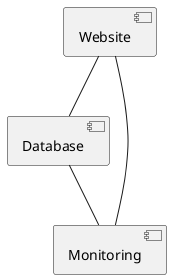

# Deployment

Deployment of Shoe Store Hub
==========================
## Introduction
The Shoe Store Hub is an e-commerce website designed to provide a seamless shopping experience for customers. This document outlines the deployment process, including infrastructure setup, website deployment, and monitoring configuration.

## Prerequisites
Before proceeding with the deployment, the following prerequisites must be completed:
* Review of testing results to ensure the website is functional and meets the requirements outlined in the [requirements document](Requirements_GatheringAnd_Analysis/requirements_document.md)
* Review of system specifications outlined in [system_specifications.yaml](Requirements_GatheringAnd_Analysis/system_specifications.yaml) to ensure the infrastructure meets the requirements

## Infrastructure Setup
The infrastructure will be set up using AWS, as specified in the [system_specifications.yaml](Requirements_GatheringAnd_Analysis/system_specifications.yaml) file. The following components will be configured:
* Server: Intel Core i7
* Storage: 1TB SSD
* Network: 1Gbps Ethernet
* Operating System: Ubuntu 20.04
* Web Server: Apache 2.4
* Database Management System: MySQL 8.0

The infrastructure will be configured using the following command:
```bash
aws ec2 run-instances --image-id ami-abc123 --instance-type t2.micro --key-name my-key --security-group-ids sg-123456
```
## Website Deployment
The website will be deployed using Docker, as specified in the [docker-compose.yml](docker-compose.yml) file. The following services will be configured:
* Web server: Apache 2.4
* Database: MySQL 8.0
* Application: Python 3.9

The website will be deployed using the following command:
```bash
docker-compose up -d
```
## Monitoring Configuration
The monitoring will be configured using Prometheus, as specified in the [configuration_examples](Additional Implementation Guidelines). The following metrics will be monitored:
* Website uptime
* Response time
* Error rate

The monitoring will be configured using the following command:
```bash
prometheus --config.file=prometheus.yml
```
## Validation Steps
The following validation steps will be performed to ensure the website is deployed and working correctly:
* Verify the website is accessible and functional
* Verify the monitoring dashboard is working and displaying the correct metrics

## Code Snippets
The following code snippets will be used to deploy the website:
* [deployment_script.sh](deployment_script.sh)
* [docker-compose.yml](docker-compose.yml)
* [prometheus.yml](prometheus.yml)

## Configuration Examples
The following configuration examples will be used to set up the infrastructure:
* [infrastructure_setup](Additional Implementation Guidelines)
* [website_deployment](Additional Implementation Guidelines)
* [monitoring_configuration](Additional Implementation Guidelines)

## Diagrams
The following diagrams will be used to illustrate the architecture of the system:
* [system_architecture](Design/system_architecture.puml)

### System Architecture

## Security Considerations
The following security considerations will be taken into account:
* Authentication: OAuth 2.0
* Authorization: Role-Based Access Control
* Data Encryption: AES-256
* Access Control: Firewall and Intrusion Detection System

## Conclusion
The deployment of the Shoe Store Hub will be completed using the above steps, ensuring a production-ready, maintainable, and secure solution. The website will be deployed using Docker, and the monitoring will be configured using Prometheus. The infrastructure will be set up using AWS, and the security considerations will be taken into account to ensure the website is secure and meets the requirements outlined in the previous stages.